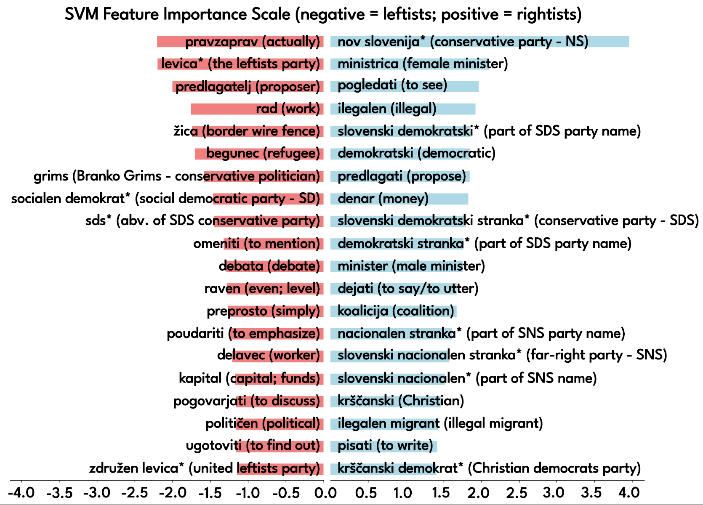
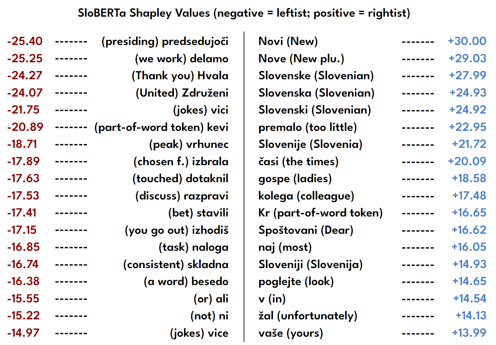

# Explainable AI in Computational Linguistics (XAICL)

### Code for the experiments in the LTC23 paper: XAI in Computational Linguistics - Understanding Political Leanings in the Slovenian Parliament -

